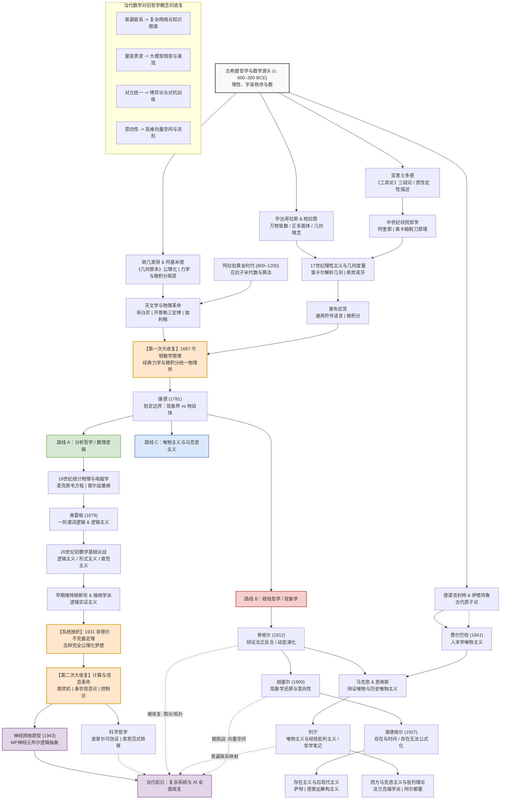

显然不同人对哲学的定义是不一样的。这篇文章定义的哲学是：首先所有学问都是哲学，其中完全通过形式验证是数学，其中同时被数学化验证和现实验证的是科学。我按照这个脉络来梳理哲学演化历史。

然后我画一下整个哲学史的演化图

```mermaid
flowchart TD
    ROOT["古希腊哲学与数学源头 (c. 600–300 BCE)<br/>理性、宇宙秩序与数"]
    
    PYTH["毕达哥拉斯 & 柏拉图<br/>万物皆数 / 正多面体 / 几何理念"]
    EUCLID_ARCH["欧几里得 & 阿基米德<br/>《几何原本》公理化 | 力学与微积分萌芽"]
    DEMOCRITUS["德谟克利特 & 伊壁鸠鲁<br/>古代原子论"]
    ARIS["亚里士多德<br/>《工具论》三段论 / 质性定性描述"]

    ARAB_MATH["阿拉伯黄金时代 (800–1200)<br/>花拉子米代数与算法"]
    SCHOL["中世纪经院哲学<br/>阿奎那 | 奥卡姆剃刀原理"]

    COPERNICUS_KEPLER["天文学与物理革命<br/>哥白尼 | 开普勒三定律 | 伽利略"]
    DESC["17世纪理性主义与几何度量<br/>笛卡尔解析几何 | 斯宾诺莎"]
    LEIB["莱布尼茨<br/>通用符号语言 | 微积分"]

    NEWTON["【第一次大收复】1687 牛顿数学原理<br/>经典力学与微积分统一物理界"]
    KANT["康德 (1781)<br/>划定边界：现象界 vs 物自体"]

    ROUTE_A["路线 A：分析哲学 / 数理逻辑"]
    STAT_PHYS["19世纪统计物理与电磁学<br/>麦克斯韦方程 | 玻尔兹曼熵"]
    FREGE["弗雷格 (1879)<br/>一阶谓词逻辑 & 逻辑主义"]
    MATH_FOUNDATIONS["20世纪初数学基础论战<br/>逻辑主义 / 形式主义 / 直觉主义"]
    WITT1["早期维特根斯坦 & 维纳学派<br/>逻辑实证主义"]
    GODEL["【系统挫折】1931 哥德尔不完备定理<br/>击碎完全公理化梦想"]
    TURING_SHANNON["【第二次大收复】计算与信息革命<br/>图灵机 | 香农信息论 | 控制论"]
    PHIL_SCI["科学哲学<br/>波普尔可伪证 | 库恩范式转移"]

    ROUTE_B["路线 B：欧陆哲学 / 现象学"]
    HEGEL["黑格尔 (1812)<br/>辩证法正反合 / 动态演化"]
    HUSSERL["胡塞尔 (1900)<br/>现象学还原与意向性"]
    HEIDEGGER["海德格尔 (1927)<br/>存在与时间 / 存在无法公式化"]
    EXIST_POSTMODERN["存在主义与后现代主义<br/>萨特 | 德里达解构主义"]

    ROUTE_C["路线 C：唯物主义与马克思主义"]
    FEUERBACH["费尔巴哈 (1841)<br/>人本学唯物主义"]
    MARX_ENGELS["马克思 & 恩格斯<br/>辩证唯物与历史唯物主义"]
    LENIN["列宁<br/>唯物主义与经验批判主义 / 哲学笔记"]
    WEST_MARX["西方马克思主义与批判理论<br/>法兰克福学派 | 阿尔都塞"]

    AI_MCCULLOCH["神经网络原型 (1943)<br/>MP神经元布尔逻辑抽象"]
    AI_NOW["当代前沿：复杂系统与 AI 全面收复"]

    ROOT --> PYTH
    ROOT --> EUCLID_ARCH
    ROOT --> DEMOCRITUS
    ROOT --> ARIS

    PYTH --> DESC
    EUCLID_ARCH --> COPERNICUS_KEPLER
    DEMOCRITUS --> FEUERBACH
    ARIS --> SCHOL
    ARAB_MATH --> COPERNICUS_KEPLER
    SCHOL --> DESC

    COPERNICUS_KEPLER --> NEWTON
    DESC --> LEIB
    LEIB --> NEWTON
    NEWTON --> KANT

    KANT --> ROUTE_A
    KANT --> ROUTE_B
    KANT --> ROUTE_C

    ROUTE_A --> STAT_PHYS
    STAT_PHYS --> FREGE
    FREGE --> MATH_FOUNDATIONS
    MATH_FOUNDATIONS --> WITT1
    WITT1 --> GODEL
    GODEL --> TURING_SHANNON
    TURING_SHANNON --> AI_MCCULLOCH
    TURING_SHANNON --> PHIL_SCI

    ROUTE_B --> HEGEL
    HEGEL --> HUSSERL
    HUSSERL --> HEIDEGGER
    HEIDEGGER --> EXIST_POSTMODERN

    DEMOCRITUS -.-> FEUERBACH
    HEGEL --> MARX_ENGELS
    FEUERBACH --> MARX_ENGELS
    MARX_ENGELS --> LENIN
    LENIN --> WEST_MARX

    AI_MCCULLOCH --> AI_NOW
    PHIL_SCI -.-> AI_NOW

    HEGEL -.->|被收复: 图论/拓扑| AI_NOW
    LENIN -.->|普遍联系映射| AI_NOW
    HUSSERL -.->|被挑战: 向量空间| AI_NOW

    subgraph AI_REDUCTION ["当代数学对旧哲学概念的收复"]
        SUB1["普遍联系 -> 复杂网络与知识图谱"]
        SUB2["量变质变 -> 大模型相变与涌现"]
        SUB3["对立统一 -> 博弈论与对抗训练"]
        SUB4["意向性 -> 高维向量空间与流形"]
    end

    classDef origin fill:#f9f9f9,stroke:#333,stroke-width:2px;
    classDef milestone fill:#ffe6cc,stroke:#d79b00,stroke-width:2px;
    classDef routeA fill:#d5e8d4,stroke:#82b366,stroke-width:2px;
    classDef routeB fill:#f8cecc,stroke:#b85450,stroke-width:2px;
    classDef routeC fill:#dae8fc,stroke:#6c8ebf,stroke-width:2px;
    classDef mathAI fill:#e1d5e7,stroke:#9673a6,stroke-width:2px;

    class ROOT origin;
    class NEWTON,GODEL,TURING_SHANNON milestone;
    class ROUTE_A routeA;
    class ROUTE_B routeB;
    class ROUTE_C routeC;
    class AI_NOW,AI_MCCULLOCH mathAI;
```
